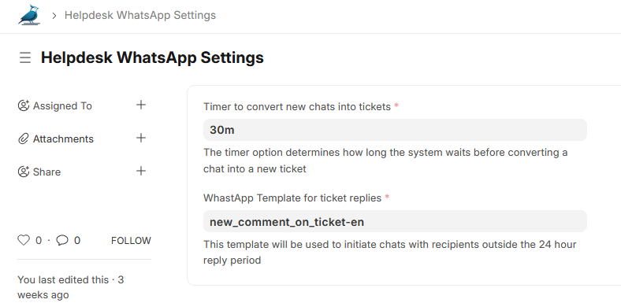
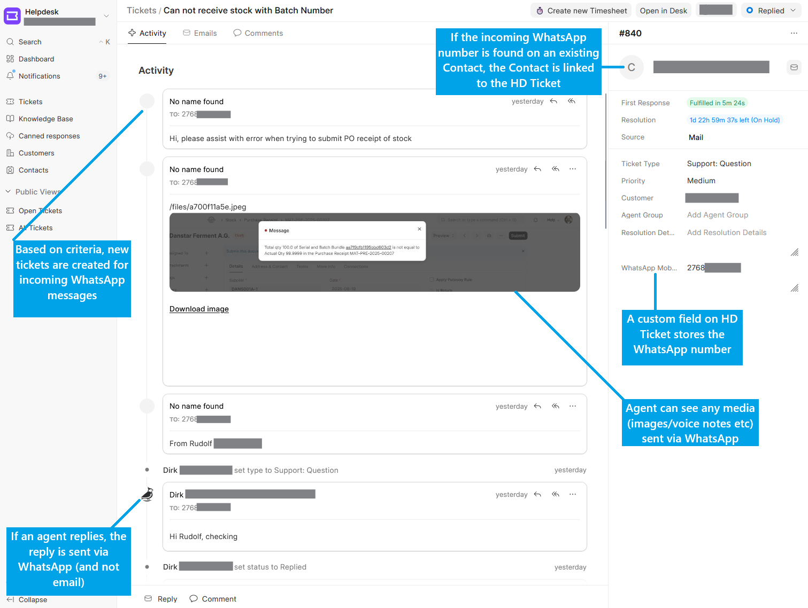

### WhatsApp Integration for Frappe Helpdesk

WhatsApp Integration for Frappe Helpdesk

### Dependencies

- [Frappe](https://github.com/frappe/frappe)
- [frappe_whatsapp](https://github.com/shridarpatil/frappe_whatsapp)
- [Helpdesk](https://github.com/frappe/helpdesk)


### Screenshots

#### Helpdesk WhatsApp Settings



#### Helpdesk Ticket view



### Caveats

This app does not modify anything in the `helpdesk` Vue source (or dist) files, which means there are some limitations:
- On the Agent's ticket view, the **Source** field incorrectly shows as **Mail**
- At this time, the only way to Reply using WhatsApp is to use the **Reply** icon on a customer's message. Using the `✉️ Reply` button at the bottom of the page will not work, because it populates the "To" field with *Guest*

Ideally these would be solved by raising PR's against frappe/helpdesk that supports "external" communication channels

### Installation

You can install this app using the [bench](https://github.com/frappe/bench) CLI:

```bash
cd $PATH_TO_YOUR_BENCH
bench get-app $URL_OF_THIS_REPO --branch develop
bench get-app https://github.com/shridarpatil/frappe_whatsapp.git
bench get-app helpdesk
bench install-app frappe_whatsapp
bench install-app helpdesk
bench install-app helpdesk_whatsapp
```
 
### Contributing

This app uses `pre-commit` for code formatting and linting. Please [install pre-commit](https://pre-commit.com/#installation) and enable it for this repository:

```bash
cd apps/helpdesk_whatsapp
pre-commit install
```

Pre-commit is configured to use the following tools for checking and formatting your code:

- ruff
- eslint
- prettier
- pyupgrade

### CI

This app can use GitHub Actions for CI. The following workflows are configured:

- CI: Installs this app and runs unit tests on every push to `develop` branch.
- Linters: Runs [Frappe Semgrep Rules](https://github.com/frappe/semgrep-rules) and [pip-audit](https://pypi.org/project/pip-audit/) on every pull request.


### License

mit
